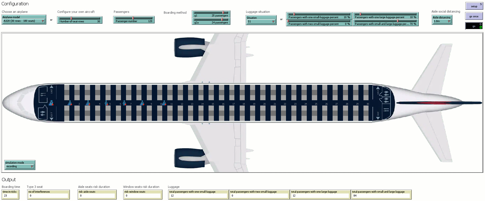

Recordings of the simulations presented in 
### **"An Investigation of Social Distancing and Quantity of Luggage Impacts on the Three Groups Reverse Pyramid Boarding Method"** 
submitted to the `Symmetry` journal. 

Please feel free to contact us at liviu.cotfas at ase .ro for further details. 

## Boarding Scenarios

All the simulations have been performed using the following settings:
- occupancy level: 100% (120 passengers).

> Suggestion: You can download the animations below in order to watch them at a higher resolution.

### 1. Social distancing: 1.0m; Luggage situation: S1; g1 = 25, g2a = 24 (G1 = 50, G2 = 58, G3 = 12)

### 2. Social distancing: 1.5m; Luggage situation: S3; g1 = 15, g2a = 15 (G1 = 30, G2 = 60, G3= 30)

### 3. Social distancing: 2.0m; Luggage situation: S2; g1 = 26, g2a = 26 (G1 = 52, G2 = 60, G3 = 8)
